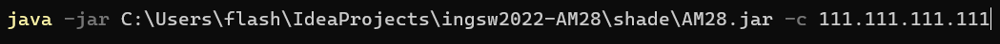

# ingsw2022-AM28

PROVA FINALE (INGEGNERIA DEL SOFTWARE) Group members:

- Lorenzo Biasiolo (lorenzo.biasiolo@mail.polimi.it)
- Isaia Belardinelli (isaia.belardinelli@mail.polimi.it)
- Leonardo Brusini (leonardo.brusini@mail.polimi.it)

--------------------------------------------
Eriantys is the final test of "Software Engineering", course of "Computer Science Engineering" held at Politecnico di Milano (2021/2022).

Teacher Alessandro Margara

What has been implemented:
Complete rules + communication + CLI + GUI + 2 FA

FA 1: Character Cards
FA 2: Resilience to client disconnections

Project specification
------------------------
------------------------------------------------
The project consists of a Java version of the board game Eriantys, made by Cranio creation.

You can find the full game here: https://www.craniocreations.it/prodotto/eriantys/.

The final version includes:

initial UML diagram;
final UML diagram, generated from the code by automated tools;
working game implementation, which has to be rules compliant;
source code of the implementation;
source code of unity tests.

Implemented Functionalities
------------------------
------------------------------------------------

Functionality	Status

Simple mode	🟢

Expert mode	🟢

Socket	🟢

GUI	🟢

CLI	🟢

Multiple games	🔴

Character Cards	🟢

Persistence	 🟢

Legend
🔴 Not Implemented     🟡 Implementing    🟢 Implemented

Test Case
---------
--------------------------------------------
All tests in model and controller has a classes' coverage at 100%.

Coverage criteria: code lines.

Package	Tested Class	Coverage

Controller | Game Manager   | 87% Methods, 91 % lines covered

Controller | Turn Manager   | 90% Methods, 95 % lines covered

Controller |EndOfGameChecker| 100% Methods, 78 % lines covered

Model      | Dash Board     | 100% Methods, 100 % lines covered

Model      | Board          | 100% Methods, 100 % lines covered

test coverage as reported by the IntelliJ tool
83% classes, 73% line covered

Ways to launch servers and clients from the command line:
---------
--------------------------------------------
FROM Terminal
---------
-TERMINAL CONFIGURATION
1. Download Windows Terminal (unlike the classic cmd, it supports all unicode characters
   necessary)
   https://apps.microsoft.com/store/detail/windows-terminal/9N0DX20HK701
2. From WINDOWS 10/11, go to SETTINGS -> Date / time and language -> LANGUAGE -> Settings
   language administration -> Administration options -> Change system locale.
   Add the check to "use UTF-8 unicode for high level language support"
   To verify that you have done all correctly, open Windows terminal, and type the
   chcp command, the response should be as follows: 

    

- GAME OPENING (WHEN I CAN ENABLE THE SERVER FROM MY PC)
1. Go to the folder that contains the “Eriantys.jar” file.
2. Open Windows terminal and type:

Where instead of "C: \ Users ..." there must be the path to your file (just drag and drop the file
with the mouse from the explorer to the terminal) and instead of "111.111 ..." there must be the ip address
that I will send you.

OTHERWISE YOU CAN START THE SERVER AND PLAY IN THIS WAY:
1. The game can be played by multiple players on the same PC, just open the terminal several times
2. If all players play on the same PC, you can start the server directly on your PC
   instead of accessing mine, opening the terminal and typing the same command but without ip address and
   with "-s" instead of "-c". At this point, start the game by opening a terminal for each player and
   typing in each of them the previous command but with ip address 127.0.0.1
3. Otherwise you can start the server and play from multiple PCs using the local network IP of the PC it is on
   the server is active, or via the public IP (but port forwarding to the
   your pc and 1234 as the port number, not a walk).

------------------------------------------------------------------------

you need at least 1 server and 2 clients are required to start the client
if you want to start a client on another pc:
- if the pc is on another network than the server -> you need a port forwarding and the IP of the server network
- if the pc is on the same network as the server -> the local IP of the server is required

